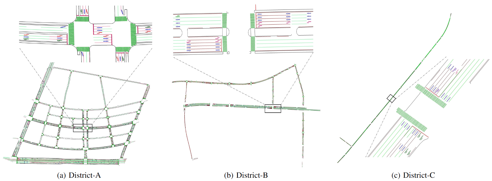
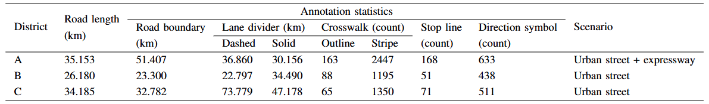
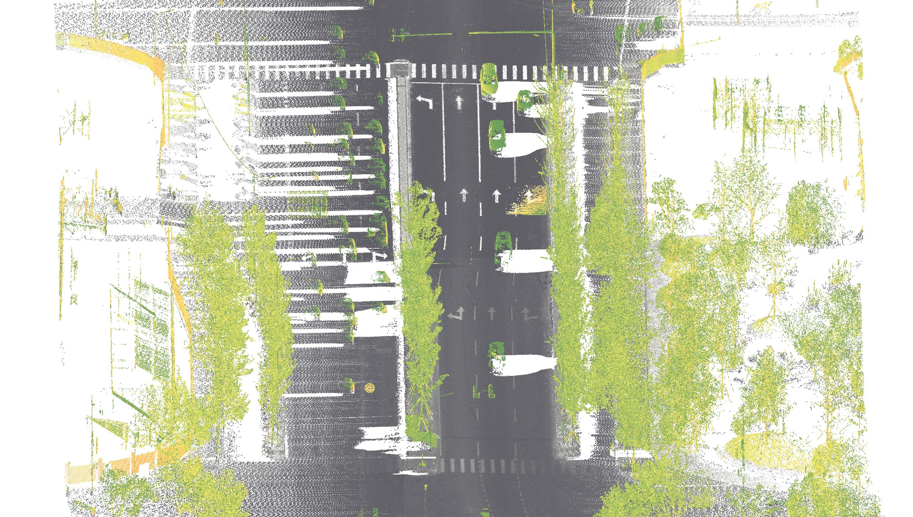
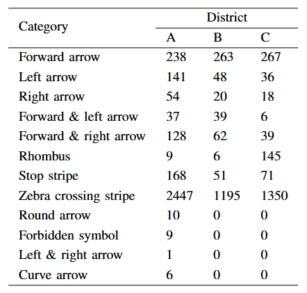
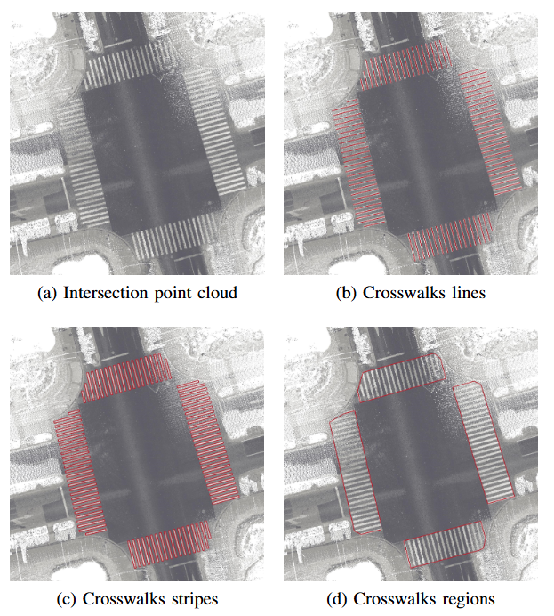
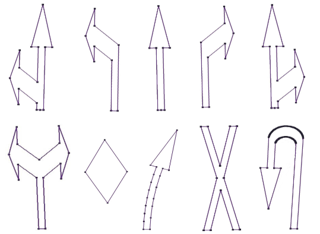
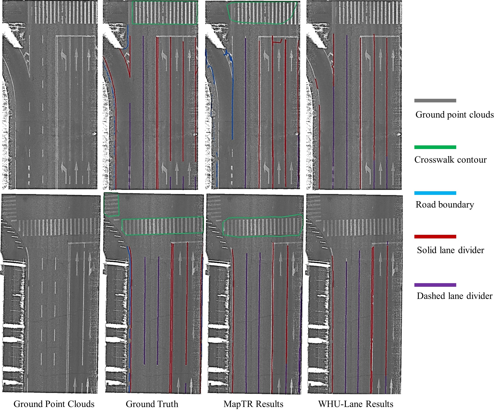
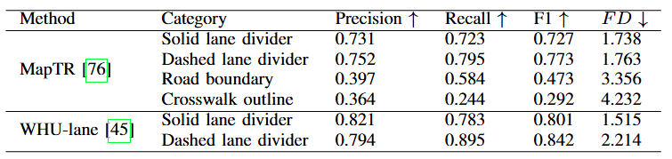
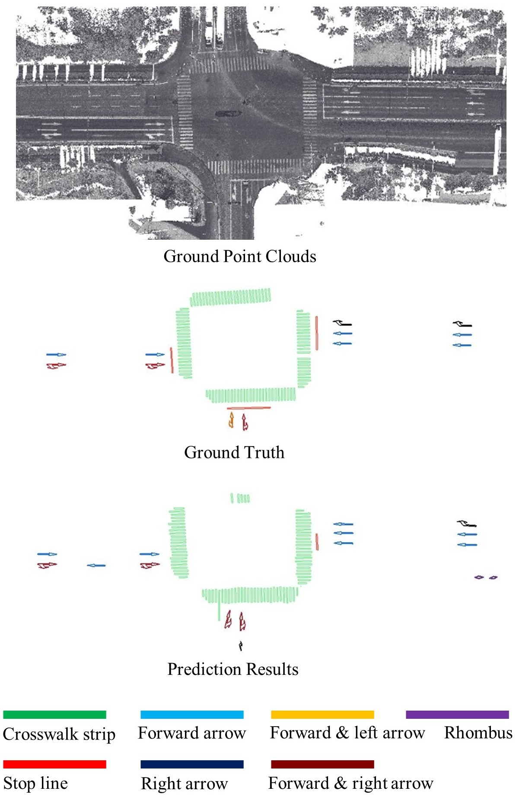
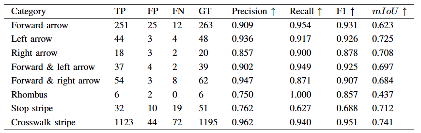

# 
 WHU-Road3D 

  
  <figcaption align="center">Figure 1: Summary of WHU-Road3D.</figcaption>

## 📖 Introduction
**WHU-Road3D: A dataset and benchmark towards fine-grained road surface mapping**

WHU-Road3D is a large-scale multimodal dataset for fine-grained road surface mapping. WHU-Road3D provides approximately 100 km of diverse Chinese highways and urban streets. It features a rich combination of MLS point clouds, associated panoramic images, vehicle trajectories, detailed vectorized annotations, and pointwise instance annotations for road surface elements. The dataset carefully annotates 15 distinct categories of road elements, including common markings like road boundaries, zebra crossings, lane dividers, stop lines, as well as 10 types of direction symbols. To our knowledge, WHU-Road3D stands as the first multimodal dataset for mapping such a comprehensive range of road surface elements, designed to facilitate cutting-edge research in instance segmentation, full-element extraction and mapping on road surfaces. 
Beyond these immediate applications, WHU-Road3D also provides a valuable source for hierarchical road topology reasoning, map updating, and street scene generation.

##  💿 Download
- [ ] ToDo: Please fill out this [Data Request](https://docs.google.com/forms/d/e/1FAIpQLSdNxLERHPY1DxJAmggWMokqFHkshFz_kZl8ABAwe6m3XPFaFA/viewform) if you have access to google forms.

- [ ] ToDo: If not, please fill out [this one](https://docs.qq.com/form/page/DQm9tenVmSmd0Vm1n) (alternative link for Chinese users).

Download links will be sent automatically after completing the application.

Main web page of our group : http://3s.whu.edu.cn/ybs/index.htm

## ✨ Dataset
### Overview
WHU-Road3D involves surveying MLS point clouds, panoramic images, associated vehicle trajectories, vectorized annotations, and point-wise instance annotations of road surface elements. WHU-Road3D intends to be the key supplementary dataset for road surface object extraction and mapping. It features diverse source data and scenario types,fine-grained vectorized and point-wise annotations. Specifically, the WHU-Road3D dataset covers typical highway and urban streets in China with 15 categories of road elements, including road boundaries, direction symbols, crosswalks, and lane dividers. Hopefully, WHU-Road3D will serve as a valuable baseline for the relevant research.

  
   <figcaption align="center">Figure 2: LoD2 road maps of three districts in WHU-Road3D.</figcaption> 

### Data Collection
The WHU-Road3D dataset incorporates surveying MLS point clouds from the mobile measurement system, which is equipped with a long-range and precise laser scanner, a high-precision inertial measurement unit (IMU), an advanced global navigation satellite system (GNSS) receiver, and/or a high-resolution high dynamic range (HDR) panoramic camera. Sensors within the system are spatiotemporal synchronized. With the vehicle platform moving, the mobile measurement system collects LiDAR points and panoramic images and records self-pose simultaneously in the street. The collected data covers road boundaries, lane dividers, crosswalks, stop lines, and direction symbols on the ground.
\par
WHU-Road3D consists of LiDAR points on around 98 km of road covering urban streets and expressways in three different districts in China. Figure  2 presents a visual overview of LoD2 road maps of three districts in WHU-Road3D. The collected data exhibits variations in point density, semantic category distribution, and cityscapes among the three districts. 
Table 1 lists the statistics of each district in WHU-Road3D. The data collected in District A covers a road of around 35.153 km, passing through urban streets and a partial expressway. Ten kinds of direction symbols on the ground are gathered. The AS-900HL multi-platform LiDAR measurement system collected the data in District A. 
The data collected in District B covers the urban street with a length of 26.18 km by the HiScan-Z 3D laser mobile measurement system. 
In District C, the LiDAR points were collected by the CHCNAV AS-900HL system, covering a road with a length of 34.185 km.

 <figcaption>Table 1: Statistics of WHU-Road3D.</figcaption>
     

The urban streets contain various road infrastructures and dynamic objects, such as poles, traffic signs, traffic lights, trees, bus stops, road intersections, road markings, vehicles, pedestrians, etc. The sizes and shapes of those infrastructures vary between categories and within each category. 
Besides, the interested road surface elements (road boundaries, lane dividers, and direction symbols) suffer significantly from the data incompleteness caused by vehicle occlusion. The busy urban roads usually contain more worn road markings. Figure 3 displays a typical urban street (panoramic image and MLS point clouds). However, the expressway suffers less from data incompleteness and worn road markings than the urban street. Generally, object extraction methods perform better in expressways than on urban streets.

    <table border="0" cellpadding="0" cellspacing="0">
        <!-- 第一行：放置图片 -->
        <tr>
            <td align="center">
                
            </td>
            <td align="center">
                
            </td>
        </tr>
        <!-- 第二行：放置子标题 -->
        <tr>
            <td align="center">
                
(a) MLS point clouds

            </td>
            <td align="center">
                
(b) Panoramic image

            </td>
        </tr>
    </table>
    <!-- 可选的全局大标题 -->
    
Figure 3: Typical urban street. 

### Annotations
The core component of WHU-Road3D is detailed 3D vectorized annotations of the road surface elements, comprising fifteen categories, including road boundaries, dashed lane dividers, solid lane dividers, crosswalks, stop lines, forward arrows, left turn arrows, right turn arrows, forward and left turn arrows, forward and right turn arrows, turn round arrows, forbidden symbols, rhombus, left and right turn arrows, and curve arrows. Table 2 displays the counts of direction symbols across three districts.

 <figcaption >Table 2: Statistics of directional symbols in WHU-Road3D.</figcaption>
     

**Road boundaries**, also called curbs (stones), are usually used to separate different road functional areas. For instance, typical road boundaries in urban scenarios are displayed in Figure \ref{fig: road boundary annotation}, which are usually artificial road infrastructures with fixed elevation differences to separate the drivable and non-drivable areas for vehicles. We annotate intersections between the vertical curb facade and the horizontal road surface as polylines according to its continuously stretching characteristics. Additionally, we accomplish the complete and continuous annotation in the data hole area.

**Lane dividers** outline the drivable lanes for vehicles, which support an orderly driving environment. It can be divided into dashed and solid lane dividers. Dashed lane dividers indicate the connection of the adjacent lanes, while solid lane dividers indicate the disconnection of the adjoining lanes. Specifically, the connection means the topological connection and permits changing lanes between adjacent lanes. Disconnection means the soft ban on changing lanes between adjacent lanes. Meanwhile, road boundaries usually have hard bans on changing lanes for vehicles.

**Crosswalks** are often found at intersections to assist pedestrians to safely cross the road, where pedestrians usually have priority over vehicular traffic. We annotate crosswalks whose appearances are black and white stripes (resembling a zebra). Specifically, we offer three annotation formats for crosswalks, including whole polygon patches, sets of stripes, and bunches of centerlines of stripes, as shown in Figure \ref{fig: crosswalk annotation}.

    
   <figcaption>Figure 4: Three types of crosswalk annotations.</figcaption> 

**Stop lines** are often found in front of crosswalks at intersections, which remind drivers to stop here until the passing signal is on. They are usually in the form of a slender white rectangle. To fit various mapping preferences, we offer annotation formats in polygon centerlines and stipes, similar to crosswalks annotation.

**Direction symbols** are countable arrows on road surfaces, which usually guide the incoming traffic rules. For instance, arrows on the road surface, such as left turn arrows, mean a left-turn permit from the current lane. And rhombuses indicate the coming crosswalks. In WHU-Road3D, we label 10 kinds of typical common symbols on road surfaces, including forward arrows, left-turn arrows, right-turn arrows, forward and left-turn arrows, forward and right-turn arrows, rhombuses, forbidden symbols, round turn arrows, left and right turn arrows, and curve arrows. 
In the WHU-Road3D dataset, direction symbols are annotated using two forms of vectorized representations: oriented bounding boxes and outline contours characterized by a predetermined number of vertices. For instance, seven ordered vertices define the forward arrow compactly. The 3D outlines are annotated for the 10 kinds of interested direction symbols, as shown in Fig. \ref{fig: road marking annotations}.

    
   <figcaption>Figure 5: Ten direction symbols’ annotations.</figcaption> 

## 📊 Benchmark
We analyze the characteristics of each kind of object. Road boundaries are far from road centerlines, distinguished by their height and textural difference from the surroundings. Lane dividers vary in visual patterns, including colors, widths, and continuities. Crosswalks, stop lines, and direction symbols are distinguished by their specific shapes and textures. Road boundaries and lane dividers can be represented as polylines with semantics. Direction symbols are represented by polygons with semantics.

We split WHU-Road3D into training and testing sets according to the scenario types and object categories. The training set comprises data from Districts A and C, while the testing set includes data from District B.

### Metrics
**Linear road markings**: Precision, Recall, F1-score, Frechet Distance
**Symbolic road markings**: Precision, Recall, F1-score, IoU

### Benchmark methods

**Linear road markings**: MapTR and WHU-Lane are selected as baselines.

**Symbolic road markings**: the modified Oriented R-CNN serves as baseline. 

The detailed experimental configurations and code for each method are available here.

- [ ] WHU-Lane:
- [ ] MapTR:
- [ ] Modified Oriented RCNN.

### Benchmark results
**Linear road markings**:

    
   <figcaption align="center">Figure 6: Visualization results for linear road marking mapping. </figcaption> 

<figcaption align="center">Table 3: Quantitative results for linear road marking mapping. </figcaption> 
    
   

**Symbolic road markings**:

    
   <figcaption align="center">Figure 7: Visualization results for symbolic road marking mapping.  </figcaption> 

   <figcaption align="center">Table 4: Quantitative results for symbolic road marking mapping.  </figcaption> 
    

## ⭐ Citation
- [ ] ToDo:

## 🤝 Related Works
  - [A Benchmark Approach and Dataset for Large-scale Lane Mapping from MLS Point Clouds](https://github.com/WHU-USI3DV/LaneMapping.git):
  - [MapTR: Structured Modeling and Learning for Online Vectorized HD Map Construction](https://github.com/hustvl/MapTR.git)
  - [OBB Detection](https://github.com/jbwang1997/OBBDetection.git)
  - [WHU-Railway3D: A Diverse Dataset and Benchmark for Railway Point Cloud Semantic Segmentation](https://github.com/WHU-USI3DV/WHU-Railway3D.git)

